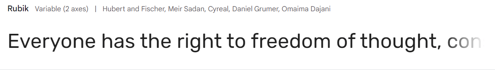

# The Couuntry Quiz
The Country Quiz is an interactive JavaScript game to test users knowledge about South America in a fun way. Usernames, correct answers and incorrect answers are recorded. The quiz has 10 questions per round which are randomized so the user can play many times. There is audio and visual feedback for both correct and incorrect answers.

Welcome to <a href="https://bpstephanie.github.io/The_Country_Quiz/">The Country Quiz</a>

## Contents
* [**User Experience UX**](<#user-experience-ux>)
  * [User Stories](<#user-stories>)
* [**Design**](<#design>)
  * [Wireframes](<#wireframes>)
  * [Site Structure](<#site-structure>)
  * [Design Choices](<#design-choices>)
  * [Typography](<#typography>)
  * [Colour Scheme](<#colour-scheme>)
* [**Features**](<#features>)
  * [csfghnh]
  * [sdcfvgbh]
  * [**Future Features**](<#future-features>)
* [**Technologies Used**](<#technologies-used>)
* [**Testing**](<#testing>)
* [**Deployment**](<#deployment>)
  * [**To Deploy the Project**](<#to-deploy-the-project>)
  * [**To Fork the Project**](<#to-fork-the-project>)
  * [**To Clone the Project**](<#to-clone-the-project>)
* [**Credits**](<#credits>)
  * [**Content**](<#content>)
  * [**Media**](<#media>)
* [**Acknowledgements**](<#acknowledgements>)

# User Experience UX
### User Stories

# Design
### Wireframes

The wireframes for The Country Quiz were created using [Balsamiq](https://balsamiq.com). As shown in the wireframes, the original topic for the quiz was Europe, however being that there are 44 countries, the concept of the answer buttons being the countries would have made for a more visually overwhelming game.

### Site Structure

The Country Quiz consists of one page, the [Main Game Page](index.html), and two pop-up windows, the How To Play Modal and the Welcome Message Modal. 

 - The How To Play Modal gives the user instructions for the quiz.

 - The Welcome Message Modal is what users will see first when loading The Country Quiz. From this window, the user will be able to navigate to the HoW To Play Modal or the Main Game Page.

- The [Main Game Page](index.html) has the following areas:
    - The username area: where the user is asked to enter their name.
    - The quiz area: which has a question counter, a space for where the question is displayed, the answer button area and the score area.
    - The footer: where links to the developers' LinkedIn and GitHub are.

### Design Choices

 - ### Typography
 The fonts chosen were 'Rubik Mono One' for the main heading and 'Rubik' for the rest of the text in the quiz. Their fall back fonts are sans-serif.

  * 'Rubik Mono One' was chosen for its' readability whilst also being fun.
  * 'Rubik' was chosen for the text for its compatability with the heading font.

 - ### Colour Scheme
   The colours chosen were to crerate a fun environment whilst creating contrast for easy viewing. A bright blue and a light blue was chosen for the background and game background. Brown for the username label, question counter and score area. Coral and off white for the game buttons and black for the outline.

# Features
### Future Features

# Technologies Used

### Languages
The floowing languages were used to create and develop this website:
* HTML5 - provides the content and structure for the website.
* CSS - provides the styling.
* JavaScript - provides the responsive quiz elements

### Rescources and Tools
* Balsamiq
* Gitpod
* Github
* Favicon
* DevTools
* Google Fonts
* Font Awesome
* Am I Responsive

# Testing
Please refer [**_here_**](TESTING.md) for more information about testing on The Country Quiz.

# Deployment
This site was deployed to GitHub pages. The steps to deploy are as follows:

  1. In the GitHub repository, navigate to the Settings tab. 
  2. Next, navigate to the Pages tab on the left hand side.
  3. Under Source, select main from the Branch dropdown menu. Then click save.
  4. Once the main branch has been selected, the page will automatically be refreshed with a detailed ribbon display to indicate the successful deployment. 

The live link can be found here - https://bpstephanie.github.io/The_Country_Quiz/ 

### **To Fork the Project**

A copy of the GitHub Repository can be made by forking the GitHub account. This copy can be viewed and changes can be made to the copy without affecting the original repository. The steps to fork the repository are as follows:

  1. Log in to GitHub and locate the repository.
  2. On the right hand side of the page, in line with the repository name, is a button called 'Fork', click on the button to create a copy of the original repository in your GitHub Account.
  

### **To Clone the Project**

The steps to clone a project from GitHub are as follows:

  1. Under the repository’s name, click on the code tab.
  2. Copy the URL under the Clone with HTTPS section.
  3. In an IDE of your choice, open Git Bash.
  4. Change the current working directory to the location of where the cloned directory will be made.
  5. Type 'git clone' then paste the URL copied from GitHub.
  6. Upon pressing enter, the local clone will be created.

### Credits

* Wireframes: [Balsamiq](https://balsamiq.com)
* Favicon: [Favicon](https://favicon.io/)
* Fonts: [Google Fonts](https://fonts.google.com/)
* Icons: [Fontawesome](https://fontawesome.com/)
* Colour Palettes: [Coolors](https://www.bbcgoodfood.com/)
* Mock-up: [Techsini](https://techsini.com/)
* Chrome for Developers: [Dev Tools](https://developer.chrome.com/docs/devtools)

