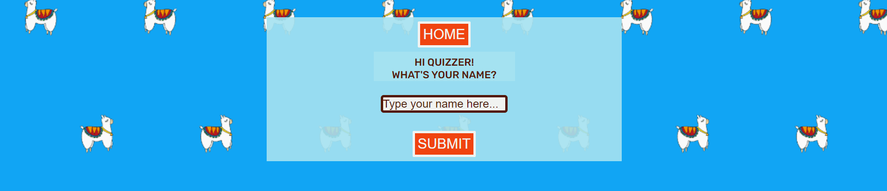
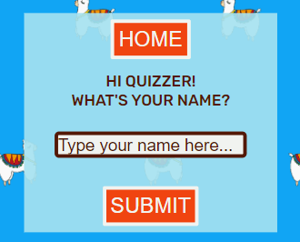
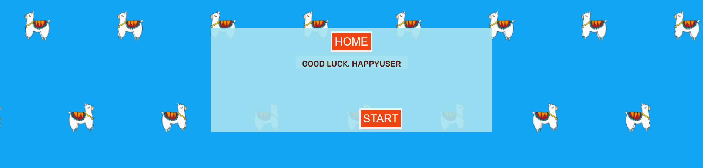

# The Couuntry Quiz
The Country Quiz is an interactive JavaScript game to test users knowledge about South America in a fun way. Usernames, correct answers and incorrect answers are recorded. The quiz has 10 questions per round which are randomized so the user can play many times. There is audio and visual feedback for both correct and incorrect answers.

Welcome to <a href="https://bpstephanie.github.io/The_Country_Quiz/">The Country Quiz</a>

## Contents
* [**User Experience UX**](<#user-experience-ux>)
  * [User Stories](<#user-stories>)
  * [Wireframes](<#wireframes>)
  * [Site Structure](<#site-structure>)
  * [Design Choices](<#design-choices>)
    * [Typography](<#typography>)
    * [Colour Scheme](<#colour-scheme>)
* [**Features**](<#features>)
  * [Existing Features](<#existing-features>)
    * [Welcome Message Modal](#welcome-message-modal)
    * [How To Play Modal](<#how-to-play-modal>)
    * [Main Game Page](<#main-game-page>)
    * [Main Heading](<#main-heading>)
    * [Username](<#username>)
    * [Start Game Button](<#start-game-button>)
      * [Restart Button](<#restart-button>)
    * [Main Game Area](<#main-game-area>)
      * [Question Counter](<#question-counter>)
      * [Question Area](<#question-area>)
      * [Answer Buttons](<#answer-buttons>)
      * [Score Area](<#score-area>)
    * [Footer](<#footer>)
  * [**Future Features**](<#future-features>)
* [**Technologies Used**](<#technologies-used>)
  * [Languages](<#languages>)
  * [Resources and Tools](<#rescources-and-tools>)
* [**Testing**](<#testing>)
* [**Deployment**](<#deployment>)
  * [**To Deploy the Project**](<#to-deploy-the-project>)
  * [**To Fork the Project**](<#to-fork-the-project>)
  * [**To Clone the Project**](<#to-clone-the-project>)
* [**Credits**](<#credits>)
  * [**Content**](<#content>)
  * [**Media**](<#media>)
* [**Acknowledgements**](<#acknowledgements>)

# User Experience UX
### User Stories

 * First-time User:
    - I want to understand how to play the quiz.
    - I want to see if I get the answer incorrect or incorrect.
    - I want to be able to restart the quiz.
    - I want to interact with and play the quiz testing my knowledge and being entertained.

 * Repeat User:
    - I want to answer different questions.
    - I want to improve my score.

 * Site Owner:
    - I want users to easily understand how to play the quiz.
    - I want users to enjoy the quiz and feel challenged answering the questions.
    - I want users to play the quiz many times.

[Back To Top](<#contents>)

### Wireframes

The wireframes for The Country Quiz were created using [Balsamiq](https://balsamiq.com). As shown in the wireframes, the original topic for the quiz was Europe, however being that there are 44 countries, the concept of the answer buttons being the countries would have made for a more visually overwhelming game.

[Back To Top](<#contents>)

### Site Structure

The Country Quiz consists of one page, the [Main Game Page](index.html), and two pop-up windows, the How To Play Modal and the Welcome Message Modal. 

 - The How To Play Modal gives the user instructions for the quiz.

 - The Welcome Message Modal is what users will see first when loading The Country Quiz. From this window, the user will be able to navigate to the HoW To Play Modal or the Main Game Page.

- The [Main Game Page](index.html) has the following areas:
    - The username area: where the user is asked to enter their name.
    - The quiz area: which has a question counter, a space for where the question is displayed, the answer button area and the score area.
    - The footer: where links to the developers' LinkedIn and GitHub are.

[Back To Top](<#contents>)

### Design Choices

 - ### Typography
 The fonts chosen were 'Rubik Mono One' for the main heading and 'Rubik' for the rest of the text in the quiz. Their fall back fonts are sans-serif.

  * 'Rubik Mono One' was chosen for its' readability whilst also being fun.

  

  * 'Rubik' was chosen for the text for its compatability with the heading font.

  

 - ### Colour Scheme
   The colours chosen were to crerate a fun environment whilst creating contrast for easy viewing. A bright blue and a light blue was chosen for the background and game background. Brown for the username label, question counter and score area. Coral and off white for the game buttons and black for the outline.

 [Back To Top](<#contents>)

# Features
  ## Existing Features

  - ### Welcome Message Modal
    When the user first enters the site, a welcome modal message appears with two buttons, the 'How To Play' button which takes the user to the instructions for the quiz and the 'Let's get Started' button which closes the modal and takes the user to the [Main Game Page](<#main-game-page>).

    Welcome Message Modal Desktop:\
    

    Welcome Message Modal Mobile:\
    

  - ### How To Play Modal
    This modal gives instructions to the user on how to play the quiz. When exitting this pop-up they will be taken back to the [Welcome Message Modal](<#welcome-message-modal>).

    How To Play Modal Desktop:
    

    How To Play Modal Mobile:
    

  - ### Main Game Page
    - #### Main Heading
      A large stylized font which is fully responsive to different screen sizes.

      Desktop main heading:
      

      Mobile main heading:\
      

    - #### Username 
      In order for a user to play the quiz, a username must be entered. The username has to be 3 - 10 character long and must be letters.

      Username Desktop:
      

      Username Mobile: \
      

      Invalid Username Alert: \
      

    - #### Start Game Button
      Once a username has been entered, a good luck message is shown and the 'Start' Button appears for the user to begin.#

      Successful Username Input Message and Start Button: 
       

      Button Hover Effect:\
      

      - ##### Restart Button
        Once the start button has been pressed, the text changes to 'Restart. This allows the user to restart the game any time they want. Once pressed, the score board and question counter will reset and a new set of random questions will be allocated to the round.

        Restart Button:\
        

    - #### Main Game Area

      Main Game Area Desktop:\
      

      Main Game Area Mobile: \
      

      The main game area consists of 4 parts:

      - ##### Question Counter 
        It will display 0/10 until the user starts the quiz. For every question that appears on screen, the counter will increase by 1 until it reaches 10, this has been generated through JavaScript.

      - ##### Question Area 
        It is generated from a JavaScript array. The questions are chosen randomly out of a possible 50 questions. When the user has finished their quiz, a final 'Well done' or 'Bad luck' message appears depending on the score of the user. Six question and above correct out of ten warrants the user a well done message, five correct answers and below receive a bad luck message.

        Well Done Message:
        

        Bad Luck Message:
        

      - ##### Answer Buttons
        Each of the answer buttons display the name of the country they represent as well at the flag. The flag was chosen as the background for more visual users and is faded out to improve contrast and readability.

        The answer buttons have a hover effect when the user moves their mouse over them. If the correct answer is chosen, the text and border will highlight green for two seconds, if the incorrect answer is chosen, the text and border will highlight red for two seconds. In both cases there is also a corresponding sound.

        After much consideration, it was decided not to highlight the correct answer if the user gets the answer. This was chosen to allow the user to play the quiz more times until they get the answer correct.

        Correct Answer Visual Feedback:
        

        Incorrect Answer Visual Feedback:
        

      - ##### Score Area
        The score area tracks both the number of correct answers and incorrect answers.

    - #### Footer
      The footer consists of two links to the developer's LinkedIn and GitHub respectively.
      
  
 [Back To Top](<#contents>)

### Future Features

  - Have difficulty levels, ranging from easy to expert.
  - Have a high score functionality for users to play many times and track their scores.
  - Have different topics, for example, a quiz on the countries in Africa or Asia.

 [Back To Top](<#contents>)

# Technologies Used

### Languages

The folloowing languages were used to create and develop this website:

* [HTML5](https://html.spec.whatwg.org/) - provides the content and structure for the website.
* [CSS](https://www.w3.org/Style/CSS/Overview.en.html) - provides the styling.
* [JavaScript](https://developer.mozilla.org/en-US/docs/Learn/JavaScript/First_steps/What_is_JavaScript) - provides the responsive quiz elements.

### Rescources and Tools
* [Balsamiq](https://balsamiq.com/wireframes/)
* [Gitpod](https://www.gitpod.io/#get-started) 
* [Github](https://github.com/)
* [Favicon](https://favicon.io/)
* [DevTools](https://developer.chrome.com/docs/devtools)
* [Google Fonts](https://fonts.google.com/)
* [Font Awesome](https://fontawesome.com/)
* [Am I Responsive](https://ui.dev/amiresponsive)
* [CloudConvert](https://cloudconvert.com/png-to-webp)
* [TinyPNG](https://tinypng.com/)

 [Back To Top](<#contents>)

# Testing
Please refer [**_here_**](TESTING.md) for more information about testing on The Country Quiz.

 [Back To Top](<#contents>)

# Deployment
This site was deployed to GitHub pages. The steps to deploy are as follows:

  1. In the GitHub repository, navigate to the Settings tab. 
  2. Next, navigate to the Pages tab on the left hand side.
  3. Under Source, select main from the Branch dropdown menu. Then click save.
  4. Once the main branch has been selected, the page will automatically be refreshed with a detailed ribbon display to indicate the successful deployment. 

The live link can be found here - https://bpstephanie.github.io/The_Country_Quiz/ 

### **To Fork the Project**

A copy of the GitHub Repository can be made by forking the GitHub account. This copy can be viewed and changes can be made to the copy without affecting the original repository. The steps to fork the repository are as follows:

  1. Log in to GitHub and locate the repository.
  2. On the right hand side of the page, in line with the repository name, is a button called 'Fork', click on the button to create a copy of the original repository in your GitHub Account.
  

### **To Clone the Project**

The steps to clone a project from GitHub are as follows:

  1. Under the repository’s name, click on the code tab.
  2. Copy the URL under the Clone with HTTPS section.
  3. In an IDE of your choice, open Git Bash.
  4. Change the current working directory to the location of where the cloned directory will be made.
  5. Type 'git clone' then paste the URL copied from GitHub.
  6. Upon pressing enter, the local clone will be created.

[Back To Top](<#contents>)

## Credits 

* Wireframes: [Balsamiq](https://balsamiq.com)
* Favicon: [Favicon](https://favicon.io/)
* Fonts: [Google Fonts](https://fonts.google.com/)
* Icons: [Fontawesome](https://fontawesome.com/)
* Colour Palettes: [Coolors](https://www.bbcgoodfood.com/)
* Mock-up: [Am I Responsive](https://techsini.com/)
* Chrome for Developers: [Dev Tools](https://developer.chrome.com/docs/devtools)

* The polka-dot background was learned from [30 Seconds of Code](https://www.30secondsofcode.org/css/s/polka-dot-pattern/). 

* Instructions on how to implement the text overlay on the brain food gallery was taken from [Banner Bear](https://www.bannerbear.com/blog/)

* Help with flexbox came from [CSS Tricks](https://css-tricks.com/)

* Help with troubleshooting came from [Stack Overflow](https://stackoverflow.com/)

[Back To Top](<#contents>)

### Content

The information on the home page is from [Nottingham.ac.uk](https://www.nottingham.ac.uk/currentstudents/wellbeing/healthyu/index.aspx) and [Sleep Foundation](https://www.sleepfoundation.org/nutrition).

The recipes on the recipes page are from [BBC Good Food](https://www.bbcgoodfood.com/) and [Eating Well](https://www.eatingwell.com/)

[Back To Top](<#contents>)

### Media

The images are from [Pexels](https://www.pexels.com/), [Pixabay](https://pixabay.com/) and [BBC Good Food](https://www.bbcgoodfood.com/).

The images were optimised with [Tinypng](https://tinypng.com/).

[Back To Top](<#contents>)

## Acknowledgements

Clean Crave has been completed as a Portfolio 1 Project, part of the Full Stack Software Developer Diploma at Code Institute. I would like to thank my Code Institute mentor,  Precious Ijege, the Slack community, and everyone at Code Institute for their help and support. 

Stephanie Bell 2024.

 [Back To Top](<#contents>)