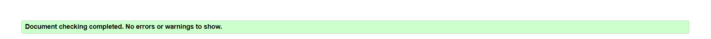
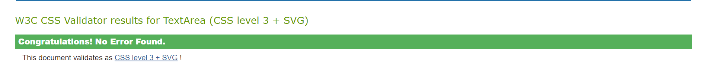
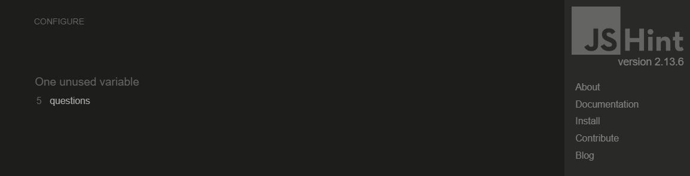
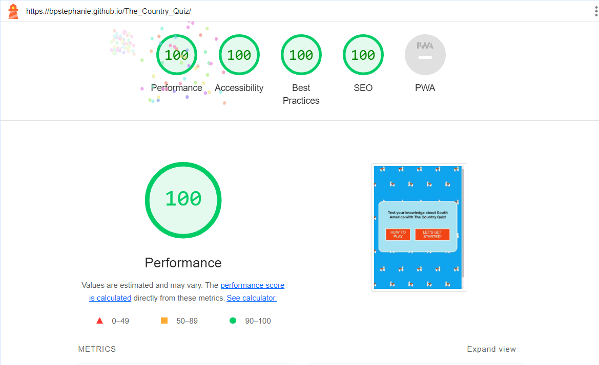
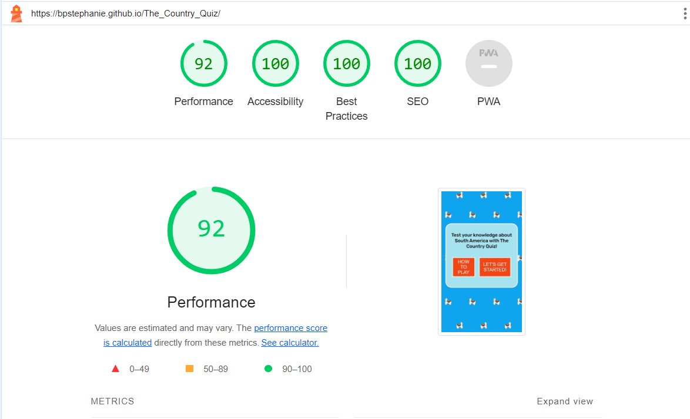
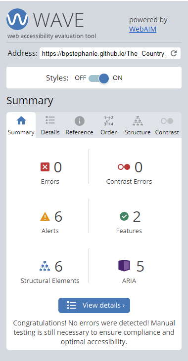
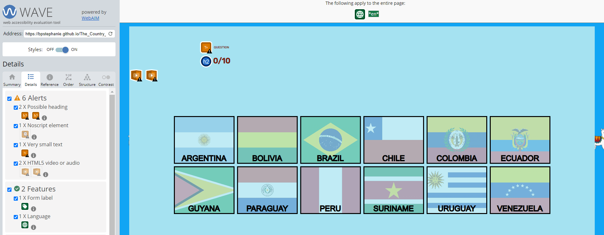

# Testing

## Validator Testing

The Country Quiz site has be thoroughly tested. All the code has been run through the [W3C html Validator](https://validator.w3.org/), the [W3C CSS Validator](https://jigsaw.w3.org/css-validator/) and the [JSHint JavaScript Validator](https://jshint.com/). Minor errors were found in the JavaScript code, such as missing semicolons and unnecessary semicolons. After a fix and retest, no errors were returned for all  three. 

The HTML W3C Validator Results:

The CSS Validator Results:

The JSHINT Validator Results for Both Pages:
- script.js:

- quiz.js:

## Responsiveness Test

The responsive design tests were carried out by [Responsive Test Tool](https://responsivetesttool.com/) and [Google Chrome DevTools](https://developer.chrome.com/docs/devtools/) manually.

|              | Xiomi 3 (360px) | Kindle (480px) | Tablet (768px) | 991px | 1024px | 1280px |
| :----------- | :---------------: | :------------: | :------------: | :---: | :----: | :----: |
| Images       |   pass            | pass           | pass           | pass  | pass   | pass   |
| Link         |   pass            | pass           | pass           | pass  | pass   | pass   |
| Rendering    |   pass            | pass           | pass           | pass  | pass   | pass   |

The Country Quiz was found to be responsive to all the screen sizes checked.

## Browser Compatibility

The Country Quiz was manually tested on Google Chrome, Safari, Mozilla Firefox, Microsoft Edge, iOS and Android with no visible issues for the user.

## Testing User Stories

* First-time User:  

 * As a user, I want to understand how to play the quiz.
    - On the Welcome Message Modal, there is a button 'How To Play' which when clicked takes the user to the instructions.

 * As a user, I want to see if I get the answer incorrect or incorrect.
    - There is audio and visual feedback with every answer the user gives. Green colouring and 'tadaa' sound for a correct answer and Red colouring and 'buzz' sound for an incorrect answer.

 * As a user, I want to be able to restart the quiz.
    - The user can restart the quiz at any moment with the 'Restart' button.

 * As a user, I want to interact with and play the quiz testing my knowledge and being entertained.
    - The quiz has a mixture of easy and difficult questions to test knowledge and the audio feedback is entertaining.

* Repeat User:

 * As a repeat user, I want to answer different questions.
    - There are 50 questions in the quiz therefore the user can play many times.

 * As a repeat user, I want to improve my score.
    - The user can improve their score by playing the quiz more times.

* Site Owner:
 * As a site owner, I want users to easily understand how to play the quiz.
    - There are instructions for the user to read.

 * As a site owner, I want users to enjoy the quiz and feel challenged answering the questions.
    - The difficulty is mixed in the questions creating a challenging quiz for the user.

 * As a site owner, I want users to play the quiz many times.
    - The randomized questions mean the user may want to play different rounds to see if they know more questions in one round as opposed to the other.
 

## Known Bugs

### Resolved

- When the quiz was restarted mid-game, there was a bug causing the question number to continue to keep increasing past 10 (e.g.  
  11/10, 12/10 and so on). I had reset the questionCounter to 0 but had not set questionCounter.innerText to 0. The correction was made.

- If a user typed in a username which was less than 3 letters or more than 10 letters, they received an alert. However, there was a bug that if they then tried to type in the correct number of letters, the 'Start Game' button did not appear. The correction was made. 

During the manual responsiveness tests, it was found that on a smaller screen, 360px, the 'Restart' button was not completely contained. Through a quick edit in CSS this was rectified.

## Additional Testing

The site was tested using [Google Lighthouse](https://developers.google.com/web/tools/lighthouse). The results were as follows:

For Desktop: \

For Mobile: \

The site was also tested using [Wave](https://wave.webaim.org/). There are no errors howvever there are 6 alerts including a small text alert and two possible headings. These have not be changed because the 'question' is intended to be small and the score area is also not meant to be headings. The results were as follows:

### Peer review
As well as the beforementioned testing, The Country Quiz was reviewed by my peers in Slack. A few points were made such as; 

- The end condolence message should show the number of questions the user got correct rather than incorrect. This was quickly changed.

- The contrast between the background colour (which was red/orange) and the placeholder (white) text wasn't very easy to read. Therefore I switched the background back to white and changed the placeholder text to be the same colour as the label.

- To add the 'Escape' key as a keydown event to act the same way as the "X" on the instructions modal. This was added.

- To increase the thickness of the horizontal ruler under "Instructions" and to add some margin between the 'Instructions' and the paragraphs. This was edited.

[Go Back To README.md](README.md)