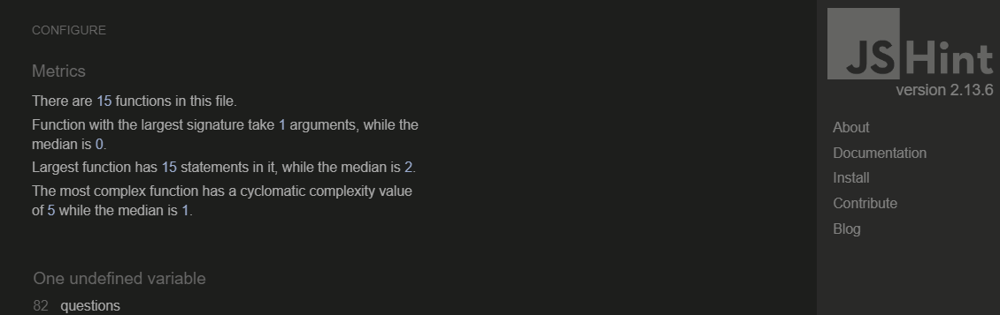

# Testing

## Validator Testing

The Country Quiz site has be thoroughly tested. All the code has been run through the [W3C html Validator](https://validator.w3.org/), the [W3C CSS Validator](https://jigsaw.w3.org/css-validator/) and the [JSHint JavaScript Validator](https://jshint.com/). Minor errors were found in the JavaScript code, such as missing semicolons and unnecessary semicolons. After a fix and retest, no errors were returned for all  three. 

The HTML W3C Validator Results:

The CSS Validator Results:

The JSHINT Validator Results for Both Pages:
- script.js:

- quiz.js:

## Responsiveness Test

The responsive design tests were carried out by [Responsive Test Tool](https://responsivetesttool.com/) and [Google Chrome DevTools](https://developer.chrome.com/docs/devtools/) manually.

|              | Xiomi 3 (360px) | Kindle (480px) | Tablet (768px) | 991px | 1024px | 1280px |
| :----------- | :---------------: | :------------: | :------------: | :---: | :----: | :----: |
| Images       |   pass            | pass           | pass           | pass  | pass   | pass   |
| Link         |   pass            | pass           | pass           | pass  | pass   | pass   |
| Rendering    |   pass            | pass           | pass           | pass  | pass   | pass   |
